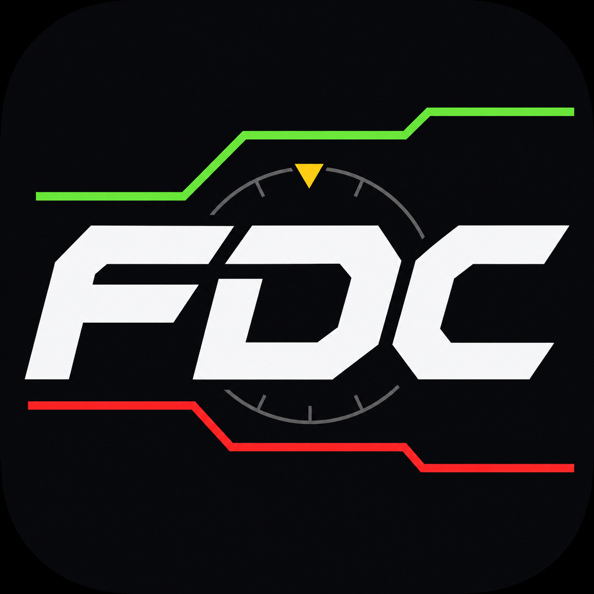
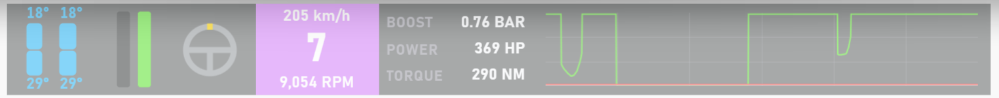
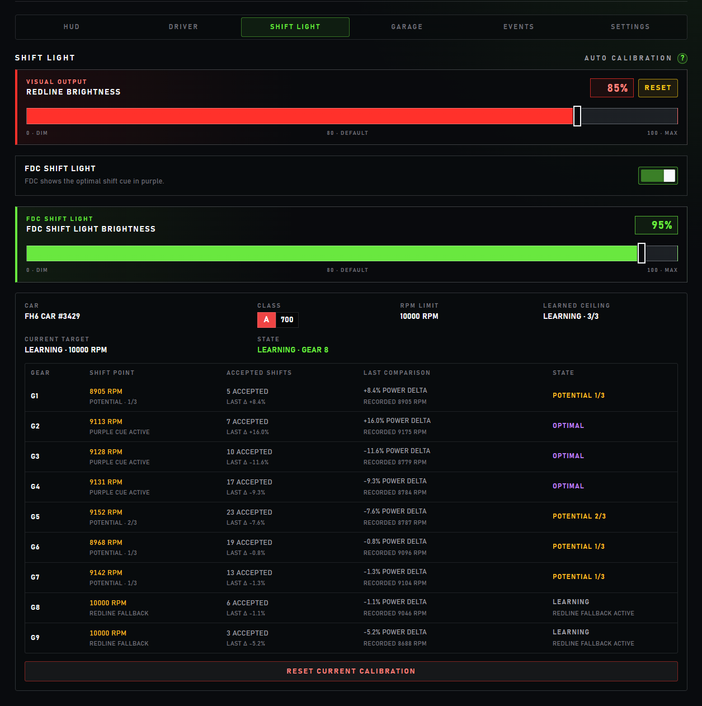
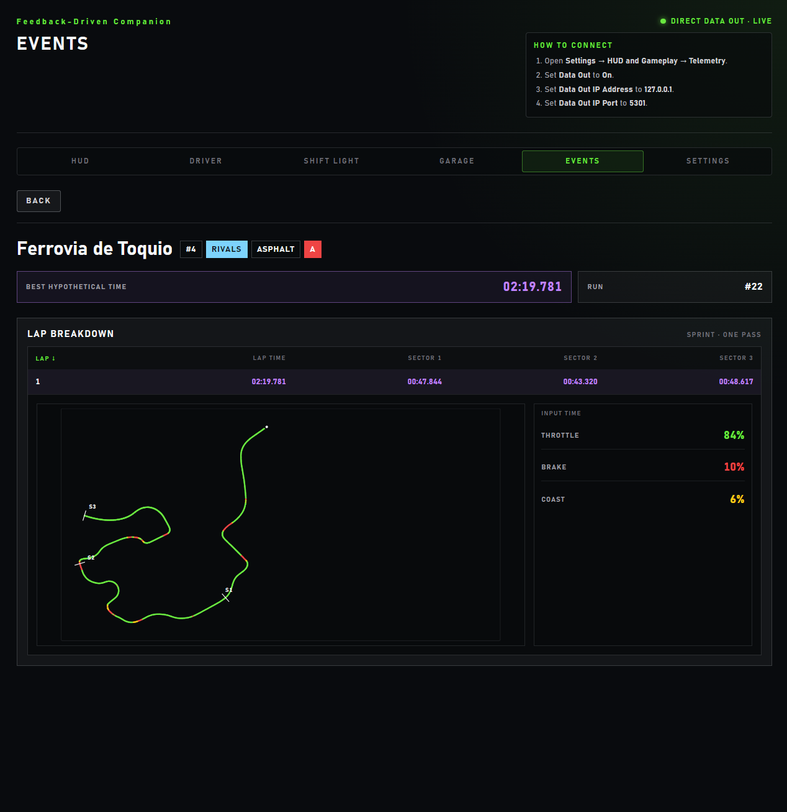
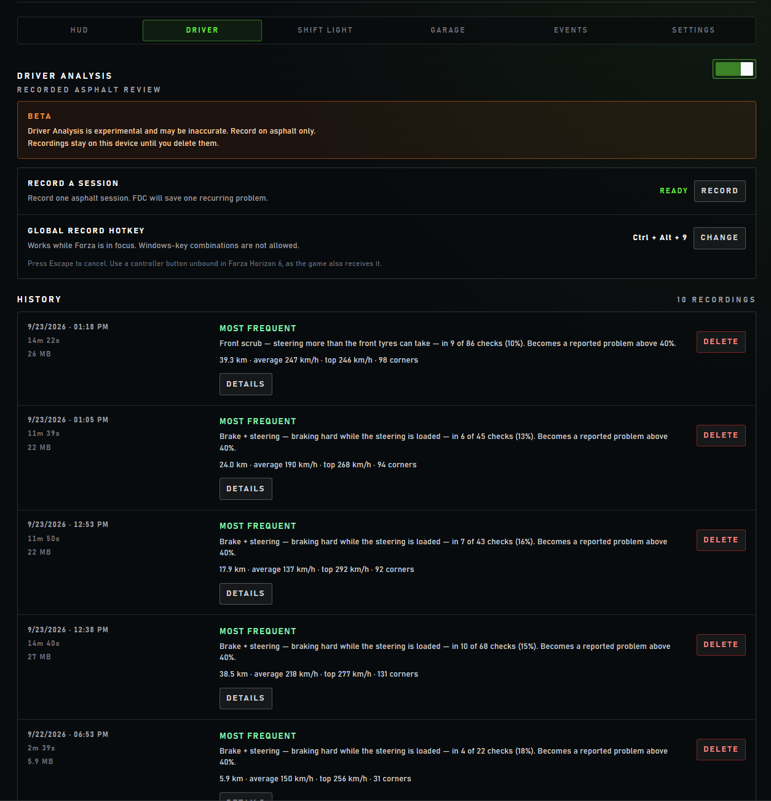

<div align="center">
  
  <h1>FDC</h1>
  <p><strong>Feedback-Driven Companion — a local-first telemetry HUD compatible with Forza Horizon 6 on Windows.</strong></p>
  <p><a href="https://github.com/kv199/fdc-application/releases/latest/download/FDC-setup.exe">Download</a> · <a href="https://github.com/kv199/fdc-application/releases">Releases</a> · <a href="SECURITY.md">Security</a></p>
  <p>
    <a href="https://github.com/kv199/fdc-application/actions/workflows/ci.yml"></a>
    <a href="LICENSE"></a>
    
  </p>
</div>


FDC receives Forza Horizon 6 Data Out directly on your PC and turns it into an
always-on-top driving HUD, learned shift cues, and local review tools. No
account, no cloud: everything stays on the local machine.

> FDC is an independent, unofficial application. It is not affiliated with,
> endorsed by, sponsored by, or otherwise approved by Microsoft, Xbox,
> Playground Games, Turn 10 Studios, or the Forza franchise. Microsoft, Xbox,
> Forza, Forza Horizon, and related names and marks belong to their respective
> owners. FDC does not include or redistribute game assets.

## Features

### HUD

Tire temperatures, throttle and brake, steering, gear, speed and RPM, boost,
power and torque, and an eight-second input graph. Keep the blocks in one
panel or place and resize each one freely, hide what you don't need, and set
the overlay opacity. The HUD stays click-through and hides in the pause menu
and garage. [More about the HUD](docs/hud.md)

<details>
<summary>HUD layout in Configuration</summary>


</details>

### Shift Light



Shift Light learns per-gear shift points for each car and tune from live
telemetry. The gear block turns red as the shift approaches and purple at the
learned optimal moment. [More about Shift Light](docs/shift-light.md)

<details>
<summary>Shift Light calibration</summary>



</details>

### Events

Create your own event library, record runs, and review every lap with sector
times, a best hypothetical time, and a top-down trace colored by throttle,
brake, and coasting. While an event is recording, Delta compares your current
lap with its fastest saved run. [More about Events](docs/events.md)

<details>
<summary>Event run details</summary>



</details>

### Driver Analysis (beta)

Record an asphalt session from Configuration, a keyboard hotkey, or a
controller button. FDC reports at most one
dominant recurring problem, or the most frequent pattern it checked, together
with the session statistics. [More about Driver Analysis](docs/driver-analysis.md)

<details>
<summary>Driver Analysis history</summary>



</details>

### Garage

Every car you drive is recorded automatically with its class, PI, and
drivetrain configurations. Name your cars locally; the latest car is shown
first. [More about Garage](docs/garage.md)

## Install

1. Download [`FDC-setup.exe`](https://github.com/kv199/fdc-application/releases/latest/download/FDC-setup.exe)
   from the latest release.
2. Check that its SHA-256 matches the `.sha256` file on the same release:

   ```powershell
   Get-FileHash .\FDC-setup.exe -Algorithm SHA256
   ```

3. Run the installer. It is **unsigned**, so Microsoft Defender SmartScreen may
   show "Windows protected your PC": select **More info** → **Run anyway**
   after the checksum matches. The administrator prompt shows "Unknown
   publisher" for the same reason.

FDC installs for all Windows users in `C:\Program Files\FDC`. If Microsoft Edge
WebView2 Runtime is missing, setup downloads it. Uninstall FDC from
**Settings → Apps → Installed apps**.

If your antivirus blocks the installer, first confirm that the file came from
the Releases page and that the checksum matches, then
[open an issue](https://github.com/kv199/fdc-application/issues) with the
antivirus name and the detection name it reports.

## Connect Forza Horizon 6

In Forza Horizon 6:

1. Open **Settings → HUD and Gameplay → Telemetry**.
2. Set **Data Out** to **On**.
3. Set **Data Out IP Address** to `127.0.0.1`.
4. Set **Data Out IP Port** to `5301`.

Start FDC. Configuration opens on the first launch and afterwards from the FDC
tray icon; it shows whether Data Out is waiting, live, stale, offline, or
unable to start.

## Local data and privacy

FDC receives Data Out from the local game session and keeps runtime data on
the machine. Garage, Events, Driver Analysis, and Shift Light data are stored
in `%APPDATA%\FDC\fdc.sqlite`; Driver Analysis recordings stay there until you
delete them. Layout and display preferences are stored in the local
application webview.

## Current limitations

- FDC supports Forza Horizon 6 Direct Data Out on Windows only.
- Driver Analysis is beta, asphalt-only, and zero-reference. It does not
  identify track surface, track identity, an ideal line, a driving score, exact
  time loss, or optimal gear advice, and it checks only steering held for at
  least 200 ms.
- Shift Light learns from live telemetry and has no manual target entry or
  car-name database.
- Garage shows image placeholders; it does not download car images or names.
- The HUD covers the primary monitor only.

## Build from source

With Node.js, npm, and Rust 1.85 or later (Windows x64, MSVC toolchain):

```powershell
npm ci
cargo build --release --locked --manifest-path src-tauri/Cargo.toml
```

The executable is `src-tauri/target/release/fdc-application.exe`. The `main`
branch holds the latest release and `develop` holds ongoing work. See
[Development](docs/development.md) and [Releasing FDC](docs/releasing.md).

## Documentation

- [HUD](docs/hud.md) — blocks, shift cue, visibility, layout, and opacity.
- [Shift Light](docs/shift-light.md) — learner, presentation, and persistence.
- [Events](docs/events.md) — event library, run recording, and Delta.
- [Driver Analysis](docs/driver-analysis.md) — recording, analysis, and history.
- [Garage](docs/garage.md) — vehicle identity and local persistence.
- [Architecture](docs/architecture.md) — system boundary and runtime data flow.

## Feedback and security

Report bugs and ideas through [GitHub issues](https://github.com/kv199/fdc-application/issues).
Report vulnerabilities privately as described in [SECURITY.md](SECURITY.md),
never in a public issue.

## License

FDC is available under the [MIT License](LICENSE).
