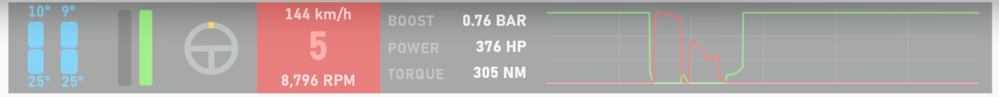
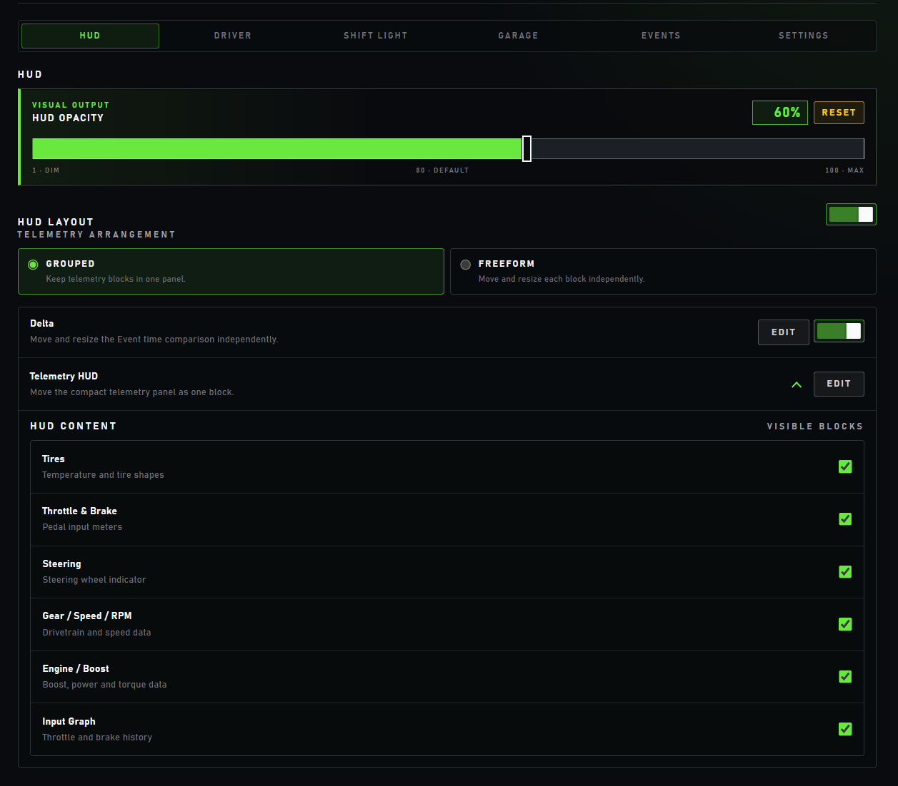
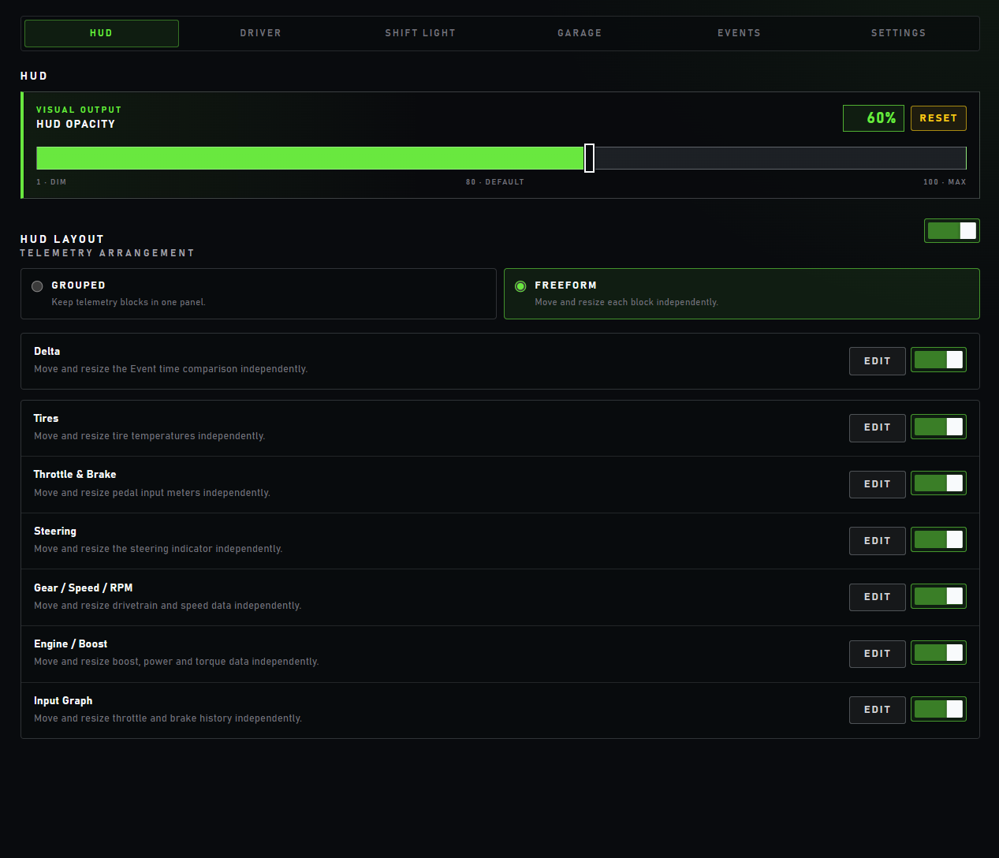

# HUD

The HUD is FDC's in-game telemetry overlay. It renders the normalized Direct
Data Out telemetry that the native layer delivers through `queueTelemetry`; it
has no other data source.

## Overlay window

- The HUD window is transparent, always on top, frameless, and never takes
  focus. At startup it covers the primary monitor.
- During normal driving the whole window is click-through, so mouse input
  reaches the game.
- Only an active layout edit makes the window accept pointer input; Save,
  Cancel, or Escape restores click-through.
- The FDC tray icon offers **Configuration** and **Quit**.

## Blocks

The telemetry HUD has six blocks. A separate Delta strip belongs to Events.

| Block | Shows |
| --- | --- |
| Tires | Front and rear tire temperatures in °C with a colored tire shape: blue below 70°, green from 70° to below 82°, yellow from 82° to below 92°, red from 92°. |
| Throttle & Brake | Vertical brake and throttle input meters. |
| Steering | A steering wheel that rotates with steering input, up to 90° at full lock. |
| Gear / Speed / RPM | Speed in the selected unit, the gear (`R`, `N`, or `1`–`10`), and engine RPM. This block also carries the shift cue. |
| Engine / Boost | Boost in bar, power in HP, and torque in N·m. Negative values show as zero, and all three show zero while the throttle is released. |
| Input Graph | The last eight seconds of throttle (green) and brake (red) input. |

**Delta** compares the current lap with the active Event reference. It is
active only while an Event is recording and has a usable reference; see
[Events](events.md#telemetry-recording).

### Shift cue

The Gear / Speed / RPM block changes its background to signal shifts:

- **Red** when Shift Light reports that the shift point is approaching, or,
  without such a report, when RPM exceeds 85% of the car's maximum RPM.
- **Purple** when Shift Light reports the learned optimal shift moment and the
  **FDC Shift Light** option is enabled.

The red and purple intensities follow the Redline Brightness and FDC Shift
Light Brightness settings. How targets are learned is described in
[Shift Light](shift-light.md).

## Visibility

- With **Show HUD with telemetry** enabled (the default), the HUD and Delta are
  visible only while Forza reports live driving. Forza keeps sending Data Out
  in the pause menu, garage, and other menus but reports that racing is not
  on, so the HUD hides there. A 500 ms hold keeps a single non-live packet from
  making it blink.
- With the option disabled, the HUD stays visible without live telemetry.
- In Configuration, the **HUD Layout** switch hides or shows the whole
  telemetry HUD, the Delta switch controls Delta, and each block can be hidden
  individually. When every block is hidden, the telemetry HUD is not shown.

## Layout

Configuration → **HUD** offers two layout modes:

- **Grouped** (default) keeps the visible blocks side by side in one panel. The
  **Telemetry HUD** row moves and resizes that panel as a whole and lists the
  visible blocks as checkboxes.
- **Freeform** gives each block its own row with **EDIT** and a visibility
  switch, so every block can be placed and sized independently.

Delta is positioned independently in both modes.

| Grouped | Freeform |
| --- | --- |
|  |  |

**EDIT** starts an on-screen edit of the selected target:

- drag the target to move it;
- drag a corner to resize it between 0.5× and 2× of its default size;
- **SAVE** keeps the change, **CANCEL** or Escape restores the previous
  position, and **RESET** returns the target to its default placement.

By default the telemetry HUD sits centered near the bottom of the screen with
Delta directly above it. Positions are stored relative to the screen size, so
they survive a resolution change. Switching modes keeps each mode's own saved
positions.

## HUD opacity

**HUD Opacity** sets the opacity of the whole overlay, including Delta, from 1%
to 100%. The default is 80%, and **RESET** restores it.

## Display settings

Configuration → **Settings** contains:

- **Configuration always on top**, off by default;
- **Show HUD with telemetry**, described above;
- **Speed unit**: `km/h` or `mph` for the HUD speed value.

## Persistence

HUD layout, block and overlay visibility, opacity, speed unit, and brightness
preferences are stored in the local application webview storage. They are not
written to `fdc.sqlite`.

## Browser demo

`index.html?demo=1` renders the HUD with synthetic telemetry for offline visual
checks; see [Development](development.md#browser-demo).
