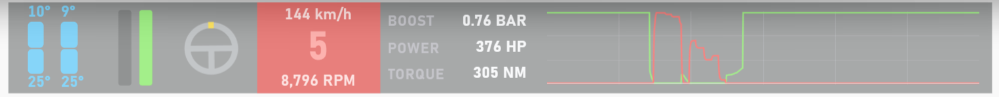

# HUD

The HUD is FDC's in-game telemetry overlay. It renders the normalized Direct
Data Out telemetry that the native layer delivers through `queueTelemetry`; it
has no other data source.

## Overlay window

- The HUD window is transparent, always on top, frameless, and never takes
  focus. It covers the monitor chosen in **HUD DISPLAY**.
- During normal driving the whole window is click-through, so mouse input
  reaches the game.
- Only an active layout edit makes the window accept pointer input; Save,
  Cancel, or Escape restores click-through. Because the window still never
  takes focus, a layout edit started with the edit hotkey leaves Forza in
  focus: the game does not pause, and the keyboard and controllers keep
  driving the car.
- The FDC tray icon offers **Configuration** and **Quit**. The X button of the
  Configuration window also quits FDC, which closes the HUD; minimizing the
  window keeps the HUD running.

## Blocks

The telemetry HUD has six blocks. A separate Delta strip belongs to Events.

| Block | Shows |
| --- | --- |
| Tires | Front and rear tire temperatures in °C with a colored tire shape: blue below 70°, green from 70° to below 82°, yellow from 82° to below 92°, red from 92°. |
| Throttle & Brake | Vertical brake and throttle input meters. |
| Steering | A steering wheel that rotates with steering input, up to 90° at full lock. |
| Gear / Speed / RPM | Speed in the selected unit, the gear (`R`, `N`, or `1`–`10`), and engine RPM. This block also carries the shift cue. |
| Engine / Boost | Boost in bar, power in HP, and torque in N·m. Negative values show as zero, and all three show zero while the throttle is released. |
| Input Graph | The last eight seconds of throttle (green) and brake (red) input. |

**Delta** compares the current lap with the active Event reference. It appears
only while recording an Event with a known reference:

- For an Event with a saved Absolute Best trace, Delta is visible immediately.
- For a new Event on a circuit, Delta is hidden during lap 1; from lap 2 onward,
  it shows the best lap so far once that lap completes.
- For a new Event in a sprint, Delta is hidden during the first attempt; from
  the second attempt onward, it shows the best result so far.
- Saved runs recorded before trace storage do not have a trace, so Delta starts
  only after the first new lap (circuit) or attempt (sprint) in that case.

See [Events](events.md#telemetry-recording).

### Shift cue

The Gear / Speed / RPM block changes its background to signal shifts:

- **Red** when Shift Light reports that the shift point is approaching, or,
  without such a report, when RPM exceeds 85% of the car's maximum RPM.
- **Purple** when Shift Light reports the learned optimal shift moment and the
  **FDC Shift Light** option is enabled.

The red and purple intensities follow the Redline Brightness and FDC Shift
Light Brightness settings. How targets are learned is described in
[Shift Light](shift-light.md).

## Visibility

- With **Show HUD with telemetry** enabled (the default), the HUD and Delta are
  visible only while Forza reports live driving; Delta additionally needs an
  active Event reference. Forza keeps sending Data Out
  in the pause menu, garage, and other menus but reports that racing is not
  on, so the HUD hides there. A 500 ms hold keeps a single non-live packet from
  making it blink.
- With the option disabled, the HUD stays visible without live telemetry.
- In Configuration, each widget in the **WIDGETS** list has its own switch,
  and **ALL** turns every widget, Delta included, on or off at once. When
  every block is hidden, the telemetry HUD is not shown. Earlier versions had
  one switch for the whole telemetry HUD; if it was off, FDC turns every block
  off on the first start of this version, so the HUD stays hidden.

## Layout

Configuration → **HUD** shows the layout controls as three separate blocks
below HUD OPACITY, the same in both arrangements:

1. **ARRANGEMENT**, a segmented choice of GROUPED (default) and FREEFORM; the
   selected one keeps a lime fill. Grouped keeps the visible blocks side by
   side in one panel and moves and resizes that panel as a whole. Freeform
   places and sizes every block independently. Delta is positioned
   independently in both arrangements, and each arrangement keeps its own
   saved positions.
2. The layout editor, built like the Driver Analysis recorder: two rows,
   each with a title and a sentence on the left and its controls on the
   right. **EDIT THE LAYOUT** has **RESET LAYOUT** and **EDIT LAYOUT** (the
   lime next step); while an edit runs it shows **EDITING** in caution yellow
   with **CANCEL** and **SAVE**. **IN-GAME EDIT HOTKEY** shows the hotkey and
   **CHANGE**, like GLOBAL RECORD HOTKEY.
3. **WIDGETS**: one compact row per widget with its name and a switch (Tires,
   Throttle & Brake, Steering, Gear / Speed / RPM, Engine / Boost, Input
   Graph, Delta), and **ALL** in the block header. Clicking anywhere on a
   row toggles its widget. **ALL** is on only while every widget is on.

Below 560 px of window width the arrangement choice moves under its
description, and each editor row stacks its controls under its text.

A layout edit covers every enabled target at once: in Grouped, the HUD panel
and Delta; in Freeform, each block whose switch is on and Delta. A switched-off
widget stays out of the edit; switch it on to place it. Two ways start it:

- **EDIT LAYOUT**. While the edit runs, **SAVE** and **CANCEL** take its place
  in Configuration, and **RESET LAYOUT** is hidden. With every widget off,
  Configuration asks to turn one on instead;
- the edit hotkey, `Ctrl + Shift + F8` by default, pressed while Forza is in
  focus. Pressing it again saves the edit. With every widget off, the hotkey
  does nothing.

**RESET LAYOUT** asks for confirmation and then returns every block and Delta
to its default place and size in both arrangements.

During the edit:

- every target in the edit stays visible, even when **Show HUD with
  telemetry** would otherwise hide it, and Delta shows without an Event;
- clicking or dragging a target on the screen selects it; the selected target shows the
  edit toolbar with `DRAG <TARGET> TO MOVE · CORNER TO RESIZE · CLICK A BLOCK
  TO SELECT` and its corner handles;
- drag any target to move it; with the grid on, it moves along the
  alignment grid described below;
- drag a corner of the selected target to resize it between 0.5× and 2× of
  its default size; resizing never snaps;
- **GRID ON**, filled with lime, on every edit toolbar turns the grid and
  snapping off and then reads **GRID OFF** with a plain frame; pressing it
  again turns them back on. It is on by default, and FDC remembers the choice;
- **SAVE** (filled with lime at rest) keeps every change; **CANCEL** (neutral
  dark, fills lime on hover) or Escape restores every target to its position
  at the start of the edit; **RESET** (caution text and border, fills caution
  on hover) returns the selected target to its default placement until the
  edit is saved or cancelled, and sits apart with extra space.

While Forza has focus, Escape reaches the game and opens its pause menu, so
use **CANCEL** to discard an edit started with the hotkey.

### Alignment grid

With **GRID** on, the edit shows an alignment grid under the HUD, and it
disappears when the edit ends:

- thin major lines divide the monitor into 4 × 4 equal zones, so the screen
  center and the edges are major lines;
- dots mark a square minor grid whose step is the screen height divided by 36,
  about 30 px at 1080p, 40 px at 1440p, and 60 px at 4K. It is measured from
  the screen center outward, so the center lines are on it; on 16:9 screens
  the major lines fall on the minor grid.

While a target is dragged, its top-left corner jumps from dot to dot: the
target's real edges, not the dashed edit frame drawn 5 px outside it, sit on
the nearest dots. When the target's center comes within half a grid step of a
major line inside the screen (25%, 50%, or 75%), the target centers on that
line instead, so it can sit exactly in the middle of the screen. Pushed
against a screen edge, a target stays flush with it. The saved position is
still relative to the screen size, so after a resolution change a target keeps
its place but may sit a few pixels off the new grid.

The edit hotkey is chosen like the Driver Analysis record hotkey: **CHANGE**,
then a key combination with Ctrl, Alt, or Shift, or a controller button. Esc
keeps the current hotkey. Windows-key combinations are not allowed, and the
edit hotkey cannot be the same as the Driver Analysis hotkey. The choice is
stored in the local application webview storage.

By default the telemetry HUD sits centered near the bottom of the screen with
Delta directly above it. Positions are stored relative to the screen size, so
they survive a resolution change. Switching modes keeps each mode's own saved
positions.

## HUD display

**HUD DISPLAY** on the HUD tab lists every connected monitor by its Windows
display number and resolution, and marks the primary monitor. Choosing one
moves the HUD to cover that monitor immediately, and FDC remembers the choice.
Until a monitor is chosen, the HUD covers the primary monitor. If the saved
monitor is not connected at startup, the HUD covers the primary monitor and the
card says so. The list is unavailable while a layout edit is active.

When Windows moves the HUD to another monitor, for example with
Win+Shift+Arrow, FDC resizes it to cover that whole monitor and remembers it as
the choice.

## HUD opacity

**HUD Opacity** sets the opacity of the whole overlay, including Delta, from 1%
to 100%. The default is 80%, and **RESET** restores it.

## Display settings

Configuration → **Settings** opens with a short intro that also notes all FDC
data stays on this PC, and contains:

- **Configuration always on top**, off by default;
- **Confirm before quitting**, on by default: the Configuration X button asks
  **QUIT FDC?** first. From the second confirmed quit the question offers
  **Don't ask again**, which turns this off. A Driver Analysis or Event
  recording in progress always asks;
- **Show HUD with telemetry**, described above;
- **Speed unit**: `km/h` or `mph` for speeds in the HUD, Events, and Driver
  Analysis;
- **Distance unit**: `km` or `mi` for distances in Events and Driver Analysis.
  Short distances, such as the Events map hover, use `m` or `ft`. A preference
  record without a distance unit defaults to `mi` when the speed unit is `mph`.

Units are display-only: telemetry, `fdc.sqlite`, and saved traces stay in
km/h and meters, and changing a unit immediately redraws the open views.

## Persistence

HUD layout, block and overlay visibility, opacity, speed and distance units,
and brightness preferences are stored in the local application webview storage. They are not
written to `fdc.sqlite`. The **HUD DISPLAY** monitor is stored in
`hud-display.json` in the FDC application-data directory, because FDC places the
HUD before the page loads.

## Browser demo

`index.html?demo=1` renders the HUD with synthetic telemetry for offline visual
checks; see [Development](development.md#browser-demo).
